# Zaim Carrière - System Architecture

## System Overview

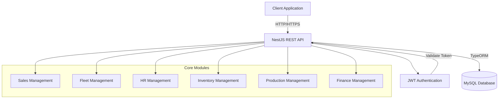

## Architecture Layers

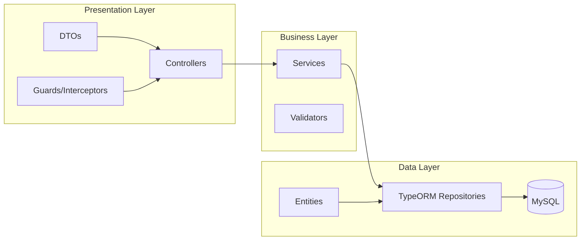

## Request Flow

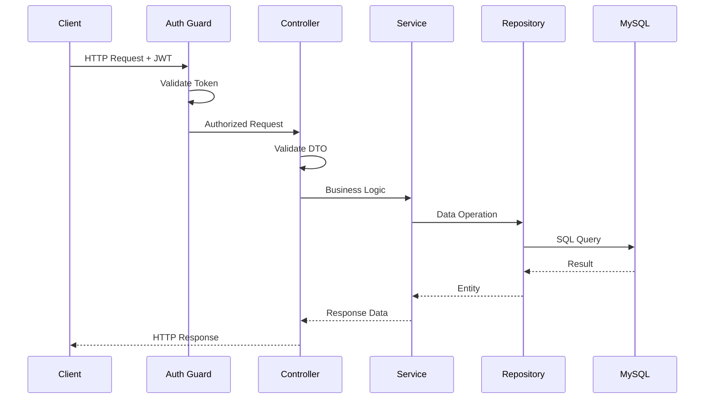

## Authentication Flow

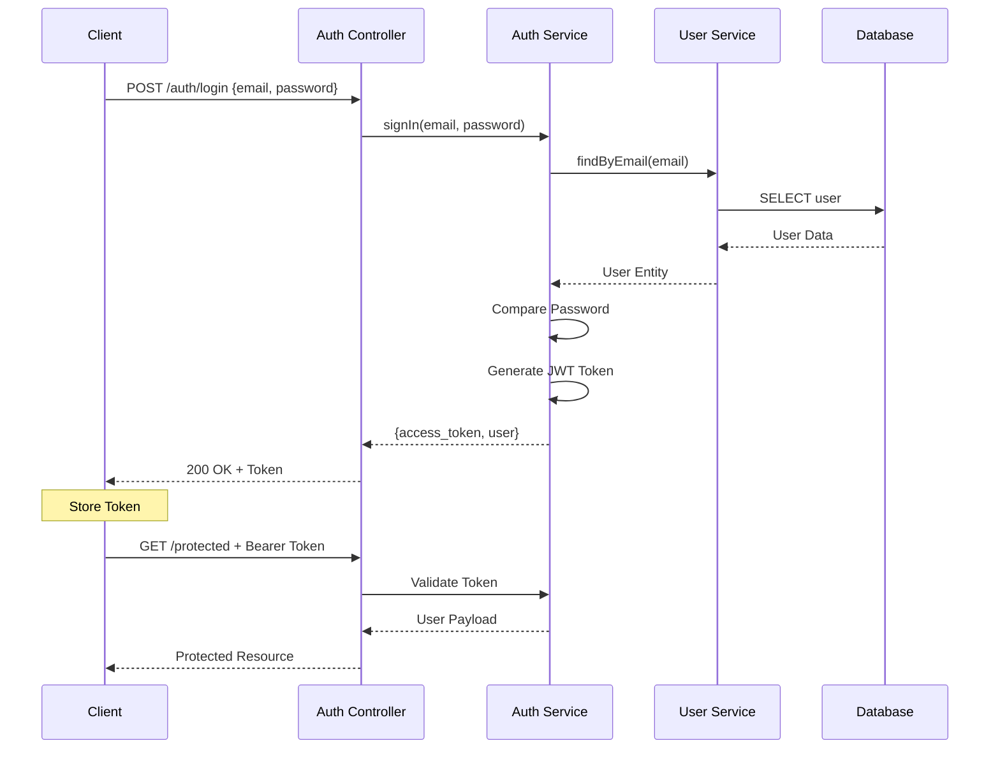

## Module Dependencies

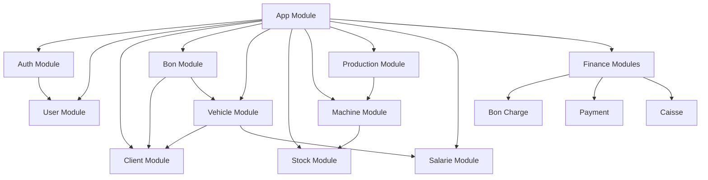

## Core Business Domains

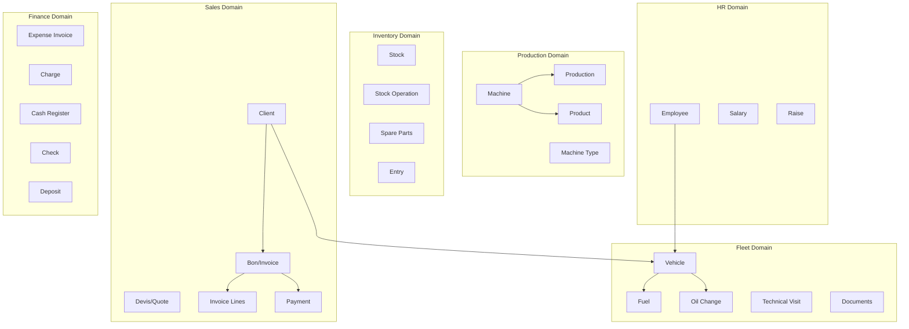

## Technology Stack

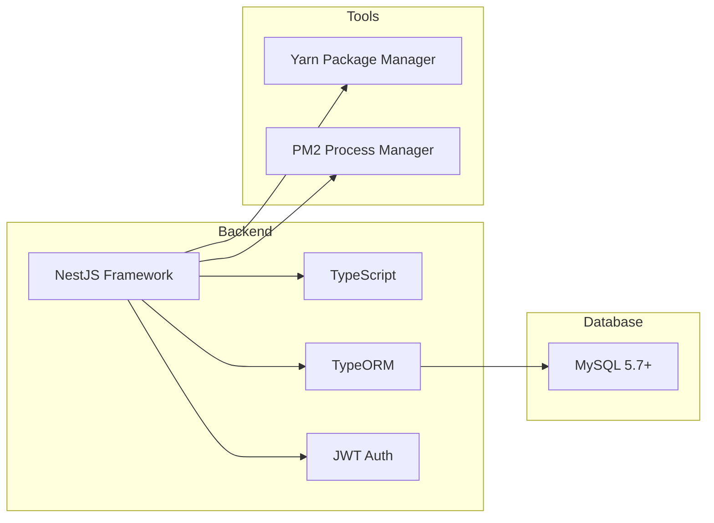

## Deployment Architecture

```mermaid
graph TB
    subgraph "Production Environment"
        PM2[PM2 Process Manager]
        App1[NestJS Instance 1]
        App2[NestJS Instance 2]
        App3[NestJS Instance 3]
    end
    
    subgraph "Database Layer"
        MySQL[(MySQL Server)]
    end
    
    subgraph "File Storage"
        Uploads[/uploads/vehicles/documents]
    end
    
    PM2 --> App1
    PM2 --> App2
    PM2 --> App3
    
    App1 --> MySQL
    App2 --> MySQL
    App3 --> MySQL
    
    App1 --> Uploads
    App2 --> Uploads
    App3 --> Uploads
```

## API Endpoints Structure

| Domain | Endpoints | Description |
|--------|-----------|-------------|
| **Auth** | `/auth/login`, `/auth/register` | Authentication & Authorization |
| **Users** | `/user/*` | User management |
| **Clients** | `/client/*` | Client management |
| **Sales** | `/bon/*`, `/devis/*` | Invoice & Quote management |
| **Fleet** | `/vehicule/*`, `/carburant/*`, `/vidange/*` | Vehicle fleet management |
| **Production** | `/production/*`, `/machine/*`, `/produit/*` | Production tracking |
| **Inventory** | `/stock/*`, `/stock-operation/*` | Inventory management |
| **HR** | `/salarie/*`, `/salaire/*` | Employee & payroll |
| **Finance** | `/bon-charge/*`, `/charge/*`, `/caisse/*`, `/payment/*` | Financial operations |
| **Reports** | `/reports/*` | Business intelligence |

## Security Features

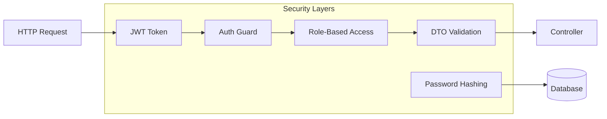

## Data Flow Patterns

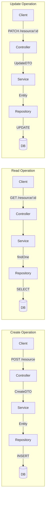

## Error Handling Flow

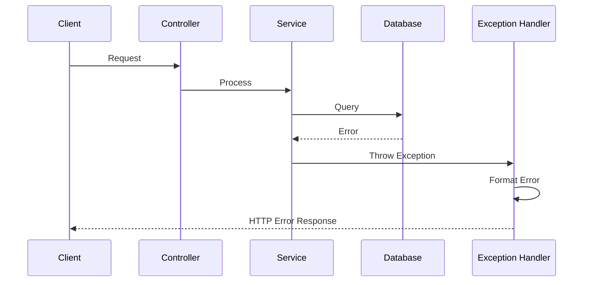

## Performance Optimization

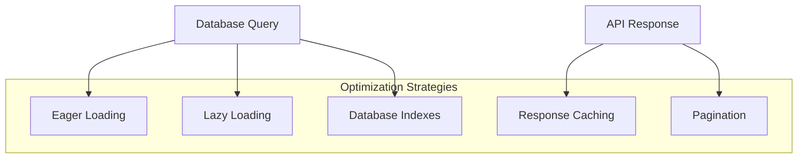

## Key Features

- **Multi-tenant Support**: Client-based data isolation
- **Real-time Tracking**: Production and fleet monitoring
- **Financial Management**: Complete accounting system
- **Document Management**: Vehicle document storage
- **Reporting**: Comprehensive business reports
- **Role-based Access**: User permissions system
- **Audit Trail**: Timestamp tracking on all entities
