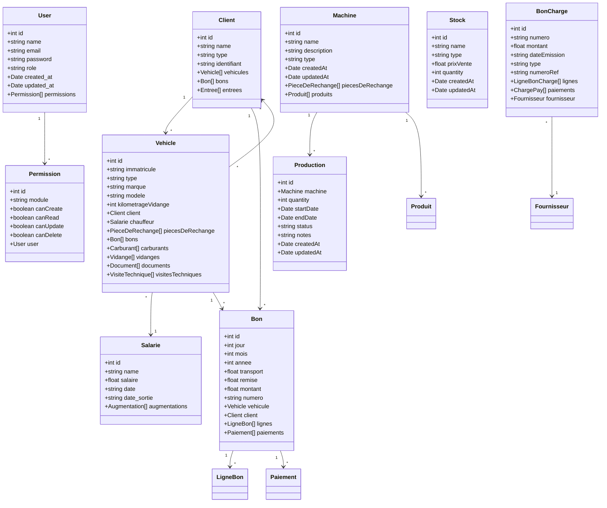
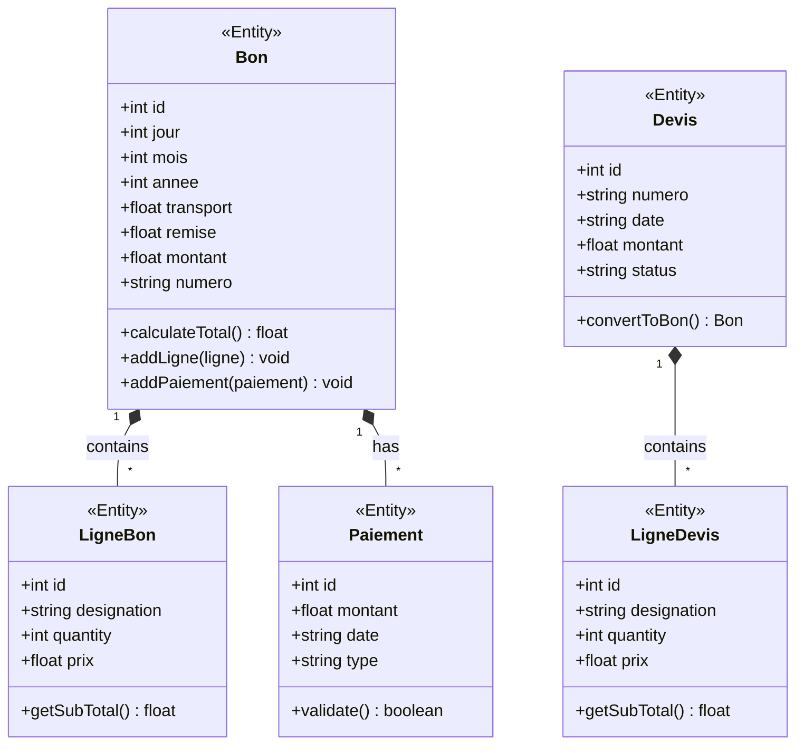
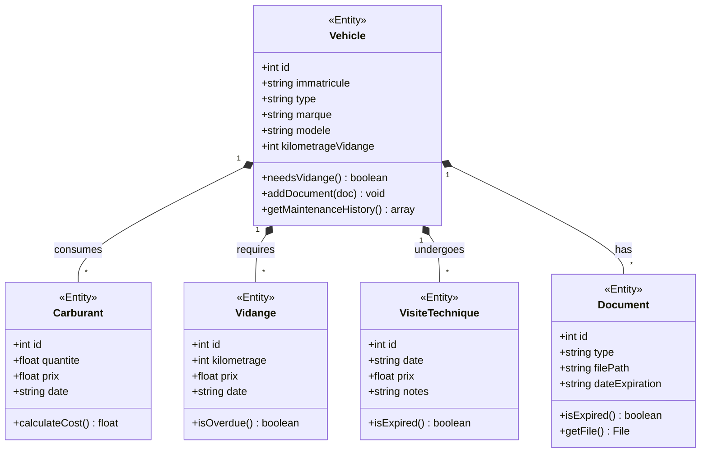
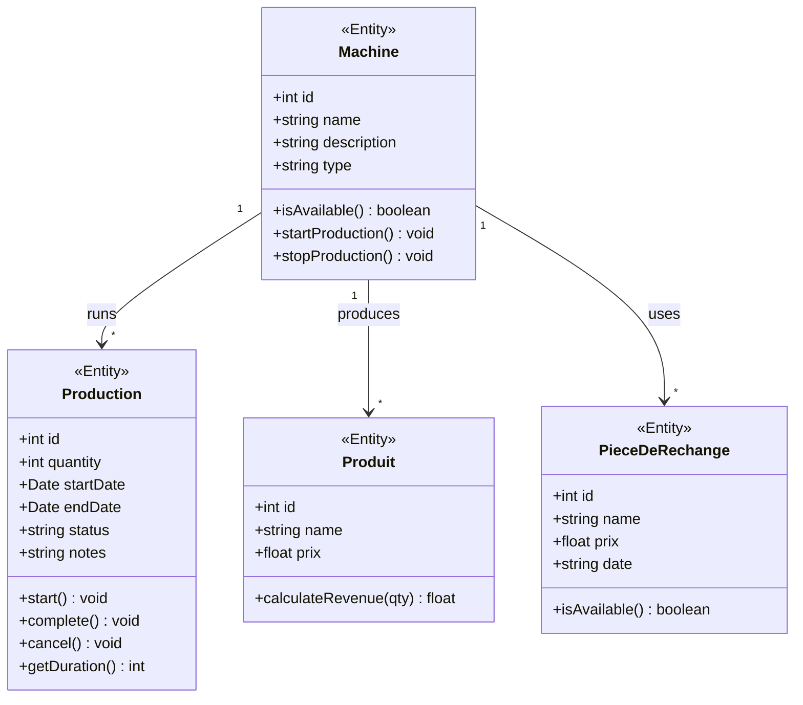
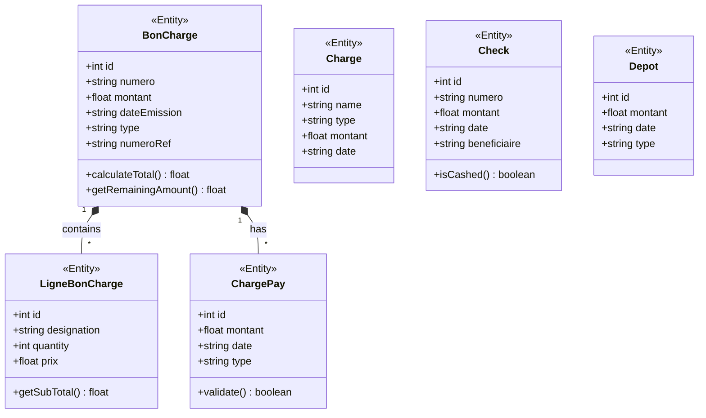
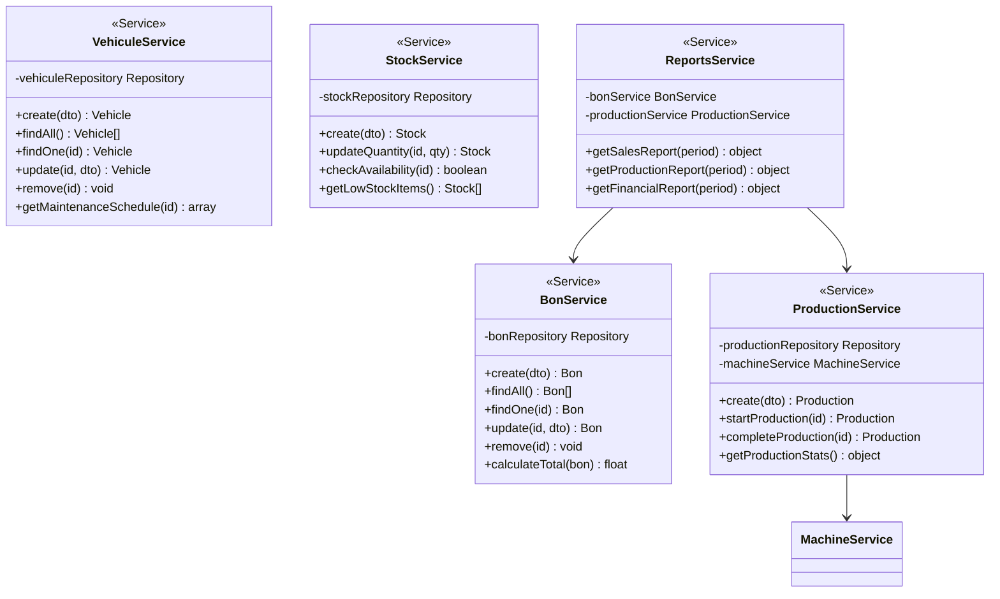
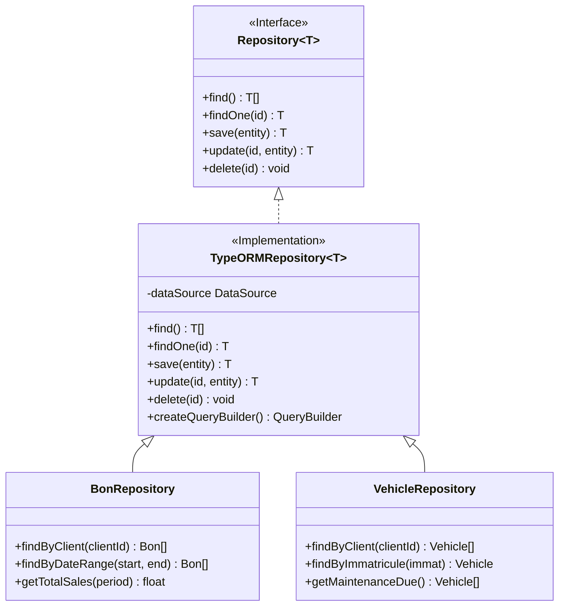
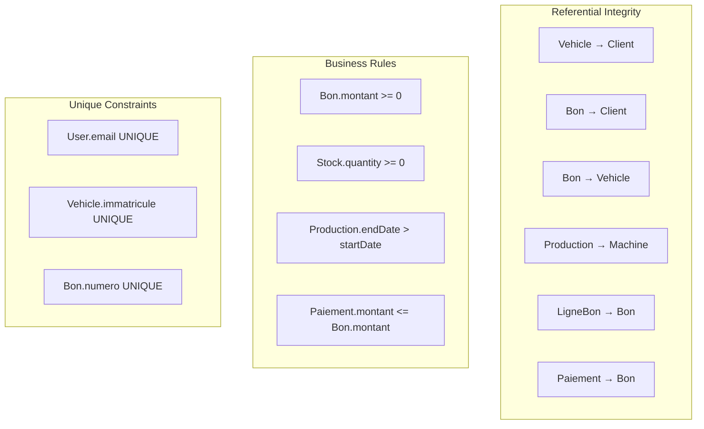

# Database Schema & Class Diagrams

## Entity Relationship Diagram

```mermaid
erDiagram
    User ||--o{ Permission : has
    User {
        int id PK
        string name
        string email UK
        string password
        string role
        timestamp created_at
        timestamp updated_at
    }
    
    Permission {
        int id PK
        string module
        boolean canCreate
        boolean canRead
        boolean canUpdate
        boolean canDelete
        int userId FK
    }
    
    Client ||--o{ Vehicle : owns
    Client ||--o{ Bon : has
    Client ||--o{ Entree : has
    Client {
        int id PK
        string name
        enum type
        string identifiant
    }
    
    Vehicle ||--o{ Bon : generates
    Vehicle ||--o{ Carburant : consumes
    Vehicle ||--o{ Vidange : requires
    Vehicle ||--o{ Document : has
    Vehicle ||--o{ VisiteTechnique : undergoes
    Vehicle ||--o{ PieceDeRechange : uses
    Vehicle }o--|| Salarie : driven_by
    Vehicle {
        int id PK
        string immatricule
        string type
        string marque
        string modele
        int kilometrageVidange
        int clientId FK
        int chauffeurId FK
    }
    
    Salarie ||--o{ Augmentation : receives
    Salarie {
        int id PK
        string name
        float salaire
        string date
        string date_sortie
    }
    
    Augmentation {
        int id PK
        float montant
        string date
        int salarieId FK
    }
    
    Bon ||--o{ LigneBon : contains
    Bon ||--o{ Paiement : has
    Bon {
        int id PK
        int jour
        int mois
        int annee
        float transport
        float remise
        float montant
        string numero
        int vehiculeId FK
        int clientId FK
    }
    
    LigneBon {
        int id PK
        string designation
        int quantity
        float prix
        int bonId FK
    }
    
    Paiement {
        int id PK
        float montant
        string date
        string type
        int bonId FK
    }
    
    Machine ||--o{ Produit : produces
    Machine ||--o{ Production : runs
    Machine ||--o{ PieceDeRechange : uses
    Machine {
        int id PK
        string name
        string description
        string type
        timestamp createdAt
        timestamp updatedAt
    }
    
    Produit {
        int id PK
        string name
        float prix
        int machineId FK
    }
    
    Production {
        int id PK
        int quantity
        timestamp startDate
        timestamp endDate
        enum status
        text notes
        timestamp createdAt
        timestamp updatedAt
        int machineId FK
    }
    
    Stock {
        int id PK
        string name
        string type
        float prixVente
        int quantity
        timestamp createdAt
        timestamp updatedAt
    }
    
    StockOperation {
        int id PK
        string type
        int quantity
        float prix
        string date
        int stockId FK
    }
    
    PieceDeRechange {
        int id PK
        string name
        float prix
        string date
        int machineId FK
        int vehiculeId FK
    }
    
    Fournisseur ||--o{ BonCharge : supplies
    Fournisseur {
        int id PK
        string ice
        string nom
        string responsable
        string email
        string telephone
    }
    
    BonCharge ||--o{ LigneBonCharge : contains
    BonCharge ||--o{ ChargePay : has
    BonCharge {
        int id PK
        string numero
        float montant
        string dateEmission
        string type
        string numeroRef
        int fournisseurId FK
    }
    
    LigneBonCharge {
        int id PK
        string designation
        int quantity
        float prix
        int bonId FK
    }
    
    ChargePay {
        int id PK
        float montant
        string date
        string type
        int bonId FK
    }
    
    Carburant {
        int id PK
        float quantite
        float prix
        string date
        int vehiculeId FK
    }
    
    Vidange {
        int id PK
        int kilometrage
        float prix
        string date
        int vehiculeId FK
    }
    
    VisiteTechnique {
        int id PK
        string date
        float prix
        string notes
        int vehiculeId FK
    }
    
    Document {
        int id PK
        string type
        string filePath
        string dateExpiration
        int vehiculeId FK
    }
    
    Devis ||--o{ LigneDevis : contains
    Devis {
        int id PK
        string numero
        string date
        float montant
        string status
    }
    
    LigneDevis {
        int id PK
        string designation
        int quantity
        float prix
        int devisId FK
    }
    
    Charge {
        int id PK
        string name
        string type
        float montant
        string date
    }
    
    Check {
        int id PK
        string numero
        float montant
        string date
        string beneficiaire
    }
    
    Depot {
        int id PK
        float montant
        string date
        string type
    }
    
    Entree {
        int id PK
        float montant
        string date
        string type
        int clientId FK
    }
```

## Class Diagram - Core Entities

## Domain Model - Sales Module

## Domain Model - Fleet Module

## Domain Model - Production Module

## Domain Model - Finance Module

## Service Layer Architecture

## Repository Pattern

## Database Indexes Strategy

| Table | Index | Columns | Type |
|-------|-------|---------|------|
| user | idx_email | email | UNIQUE |
| client | idx_name | name | INDEX |
| vehicle | idx_immatricule | immatricule | UNIQUE |
| vehicle | idx_client | clientId | INDEX |
| bon | idx_numero | numero | UNIQUE |
| bon | idx_client | clientId | INDEX |
| bon | idx_date | annee, mois, jour | INDEX |
| production | idx_machine | machineId | INDEX |
| production | idx_status | status | INDEX |
| production | idx_date | startDate, endDate | INDEX |
| stock | idx_name | name | INDEX |
| bon_charge | idx_fournisseur | fournisseurId | INDEX |

## Data Integrity Constraints

