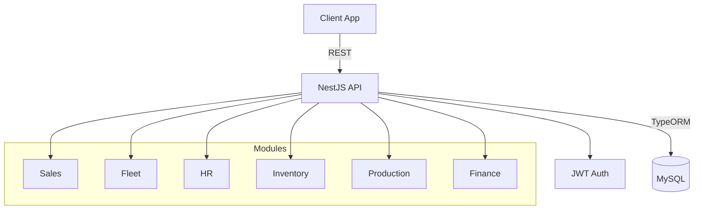
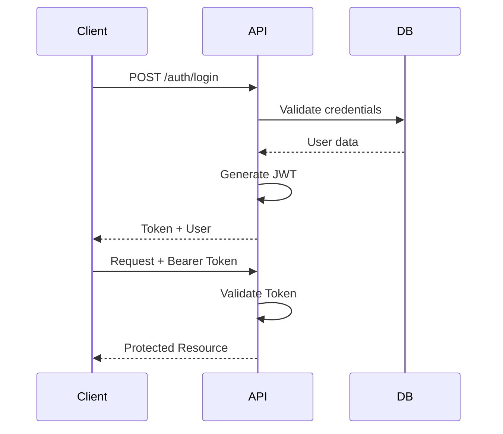
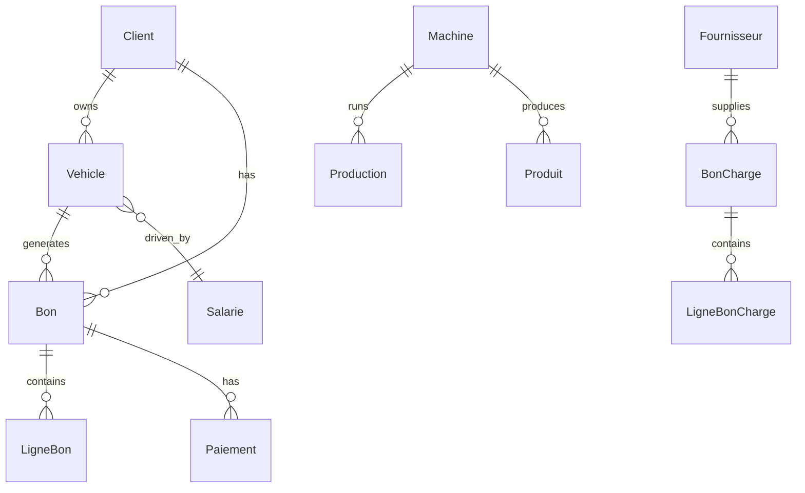

# Zaim Carrière - Enterprise Management System

## 📋 Project Overview

Comprehensive ERP system for quarry/construction material business management built with NestJS, TypeScript, and MySQL.

## 🏗️ System Architecture



## 🚀 Quick Start

```bash
# Install dependencies
yarn install

# Configure environment
cp .env.example .env

# Run development
yarn start:dev

# Run production
yarn start:prod
```

## 📊 Core Modules

| Module | Entities | Features |
|--------|----------|----------|
| **Sales** | Bon, Devis, Client | Invoice management, Quotes, Payments |
| **Fleet** | Vehicle, Carburant, Vidange | Vehicle tracking, Fuel, Maintenance |
| **Production** | Machine, Production, Produit | Production planning, Machine management |
| **Inventory** | Stock, StockOperation | Inventory control, Stock movements |
| **HR** | Salarie, Salaire, Augmentation | Employee management, Payroll |
| **Finance** | BonCharge, Charge, Caisse | Expense tracking, Cash management |

## 🔐 Authentication Flow



## 📁 Project Structure

```
src/
├── auth/              # Authentication & JWT
├── user/              # User management
├── client/            # Client management
├── bon/               # Invoice system
├── vehicule/          # Fleet management
├── production/        # Production tracking
├── machine/           # Machine management
├── stock/             # Inventory control
├── salarie/           # HR management
├── bon-charge/        # Expense management
├── caisse/            # Cash register
├── reports/           # Business intelligence
└── main.ts            # Application entry
```

## 🗄️ Database Schema



## 🔧 Technology Stack

- **Framework**: NestJS 10.x
- **Language**: TypeScript 5.x
- **ORM**: TypeORM
- **Database**: MySQL 5.7+
- **Authentication**: JWT
- **Process Manager**: PM2
- **Package Manager**: Yarn

## 📡 API Endpoints

| Endpoint | Method | Description |
|----------|--------|-------------|
| `/auth/login` | POST | User authentication |
| `/client` | GET, POST | Client management |
| `/bon` | GET, POST | Invoice operations |
| `/vehicule` | GET, POST | Vehicle management |
| `/production` | GET, POST | Production tracking |
| `/stock` | GET, POST | Inventory control |
| `/salarie` | GET, POST | Employee management |
| `/reports` | GET | Business reports |

## 🔒 Security Features

- JWT-based authentication
- Role-based access control (RBAC)
- Password hashing (bcrypt)
- DTO validation
- SQL injection protection (TypeORM)
- CORS configuration

## 📈 Performance

- Database indexing strategy
- Eager/Lazy loading optimization
- Response pagination
- Query optimization
- PM2 clustering

## 🧪 Testing

```bash
# Unit tests
yarn test

# E2E tests
yarn test:e2e

# Test coverage
yarn test:cov
```

## 📚 Documentation

- [Architecture Documentation](./ARCHITECTURE.md) - System architecture & flows
- [Database Diagrams](./DATABASE-DIAGRAM.md) - ERD & class diagrams

## 🚢 Deployment

```bash
# Using PM2
pm2 start ecosystem.config.cjs

# Using Mau (NestJS Cloud)
mau deploy
```

## 🌟 Key Features

✅ Complete ERP solution  
✅ Multi-module architecture  
✅ Real-time production tracking  
✅ Fleet management system  
✅ Financial accounting  
✅ Document management  
✅ Business intelligence reports  
✅ Role-based permissions  
✅ RESTful API design  
✅ TypeScript type safety  

## 📞 Support

For issues and questions, please refer to the [NestJS Documentation](https://docs.nestjs.com).

## License

Nest is [MIT licensed](https://github.com/nestjs/nest/blob/master/LICENSE).

---

**Built with ❤️ using NestJS**
